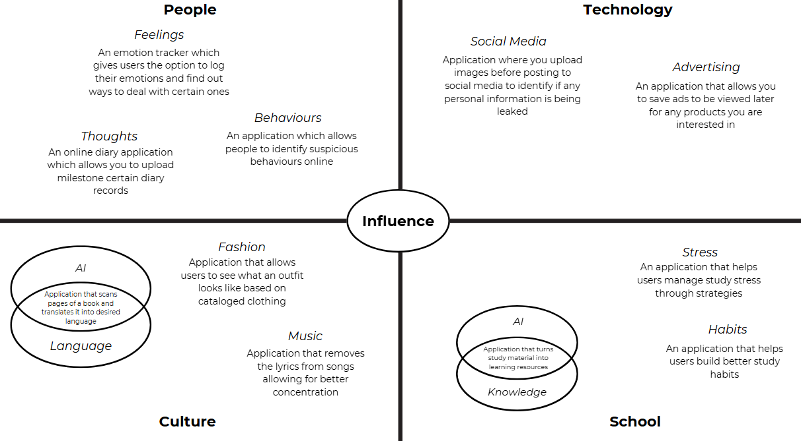

# Identifying and Defining

**Divergent Thinking**  

**Convergent Thinking**

| Idea Name | What it does | Influence it Explores | Who it helps |
| :---- | :---- | :---- | :---- |
| Student Stress Management  | Provides strategies, planners, tools and information on how to reduce student stress | School \> Stress | Students |
| Virtual Outfits  | Lets users see outfits digitally using certain catalouged clothing | Culture \> Fashion | Shoppers |
| Book Translations | Scans an upload photo of a book page and translates into desired language | Culture \> Language \+ AI | Students, language learners, readers |
| Study Resource Creator | Converts raw articles and materials into usable study resources such as quizzes and flashcards | School \> Knowledge \+ AI | Students or Teachers |
| Saved Ads Cart | Saves viewed ads to see them later, like website shopping carts | Technology \> Advertising | Shoppers |
| Milestone Diary App | Online diary/journal entry site which allows users to mark milestones | People \> Thoughts | General public |

**Requirements Outline**

*Functional:*

User Interaction:

- Users will interact with the app mainly through simple button taps, form entries and navigation menus.  
- Actions: Users will be able to log stress levels, create or edit study schedules, start/stop the Pomodoro timer, write journal entries, and view personalized suggestions.

Core Features and Mechanics:

- Task & Time Management: Schedule maker allows users to plan days by adding tasks. An additional pomodoro timer allows students to work in focused intervals with break reminders.  
- Study Stress Management Strategies Library:  
- Provides categorised resources such as breathing exercises, time management tips, and motivational content, articles how to reduce study stress

**SWOT Analysis**

From my Impact/Effort Matrix and SWOT analysis, I can identify that both are worthwhile ideas but the student stress management app/website shows a clearer and more extensive impact. From my SWOT analysis, I noted that even though it would involve ensuring that information is trustworthy and users are actively involved, its strengths and advantages surpass its weaknesses significantly. It solves a universal problem faced by the student population directly since stress is continually shown in my survey responses as a key area of concern. Its ability to save students time by offering approaches in one location, in combination with potential collaboration and community involvement opportunities, make this concept extremely practical and sustainable. Based on consideration about these factors, I concluded I will pursue a student stress management app/website as my final concept.

