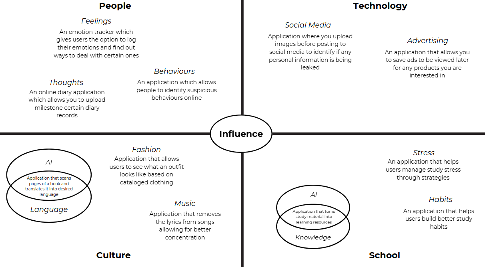

# Identifying and Defining

**Divergent Thinking**  

**Convergent Thinking**

| Idea Name | What it does | Influence it Explores | Who it helps |
| :---- | :---- | :---- | :---- |
| Student Stress Management  | Provides strategies, planners, tools and information on how to reduce student stress | School \> Stress | Students |
| Virtual Outfits  | Lets users see outfits digitally using certain catalouged clothing | Culture \> Fashion | Shoppers |
| Book Translations | Scans an upload photo of a book page and translates into desired language | Culture \> Language \+ AI | Students, language learners, readers |
| Study Resource Creator | Converts raw articles and materials into usable study resources such as quizzes and flashcards | School \> Knowledge \+ AI | Students or Teachers |
| Saved Ads Cart | Saves viewed ads to see them later, like website shopping carts | Technology \> Advertising | Shoppers |
| Milestone Diary App | Online diary/journal entry site which allows users to mark milestones | People \> Thoughts | General public |

# Requirements Outline

### **Functional:**

**User Interaction:**

- Users will interact with the app mainly through button clicks, scrolling, text inputs and form entry
- *Study Articles:* Browse and scroll through library of stress and study management articles
- *Pomodoro Timer:* Button to start/pause/reset study and break sessions
- *Study Planner:* Add, edit, delete study tasks. Similar to google calendar, just more targeted at students
- *Forums*: Post questions, share/seek advice and communicate with peers

**Core Features:**
- Articles: Provide evidence-based strategies for stress management. Supports bookmarking for later reading.
- Pomodoro Timer: Default 25min study and 5min break sessions to help students manage focus. Long breaks after multiple sessions.
- Study Planner: Daily/weekly/monthly planning with reminders. Encourages balance between study and breaks.
- Forums: Peer support community with topic categories, includes auto-moderation and filtering. Limit forum entries to 10 per user per day, to avoid distraction and being turned into a messaging platform.

**Feedback**

- Pomodoro Timer: Once a study or break session ends, notify user
- Study Planner: Displays progress summaries (e.g., tasks completed vs pending). 
- Articles: Users can rate or mark articles as helpful. 
- Forums: Replies to user forum message notifies the user

**Saving and Loading Data:**
- User data is automatically saved globally to their account.
- Data synced across devices when logged in.
- Offline access for saved articles, planner, and Pomodoro timer. 
- Online access required for study forums

### **Non-Functional** ###

**Performance Requirements**
- App should load within 5 seconds on launch. Opening and redirecting to other pages should load within 3 seconds to minimise confusion and maximise a smooth user experience
- Forums should send messages within 5 minutes, accounting for any filtering or moderation

**Usability Requirements**
- UI should be simple, intuitive and minimalistic to avoid any user confusions
- There should be a navigation bar so that users can switch seemlessly between core features
- Accessibility: support for different sizes of screens to account for mobile users

**Security Requirements:**
- Personal settings such as study planner tasks and user settings will be stored securely and encrypted to ensure privacy of users. Further, The app will make use of secure login systems to allow users to access account on different devices.

**SWOT Analysis**

From my Impact/Effort Matrix and SWOT analysis, I can identify that both the student stress managament site and the self-diary milestone stie are worthwhile ideas but the student stress management app/website shows a clearer and more extensive impact. From my SWOT analysis, I noted that even though it would involve ensuring that information is trustworthy and users are actively involved, its strengths and advantages surpass its weaknesses significantly. It solves a problem faced by the student population directly since stress is as a key area of student concern. Its ability to save students time by offering approaches in one location, in combination with potential collaboration and community involvement opportunities, make this concept extremely practical and sustainable. Based on consideration about these factors, I have decided I will create a student stress management app/website as my final concept.

